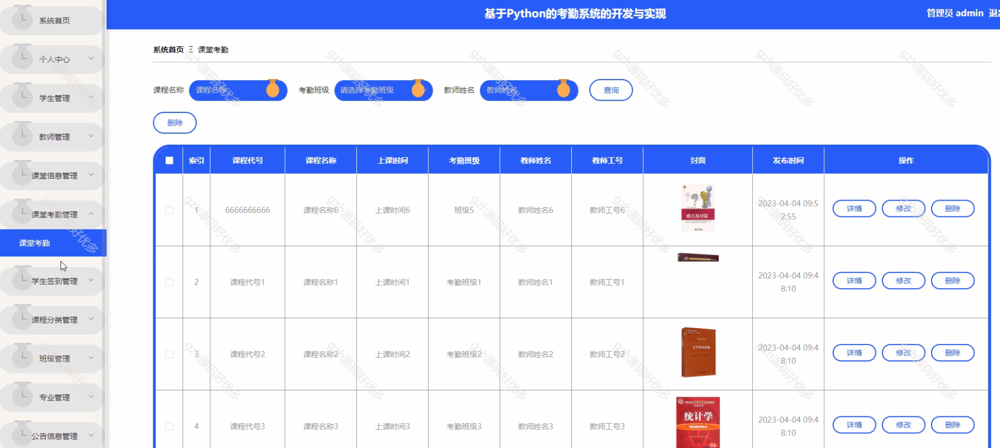
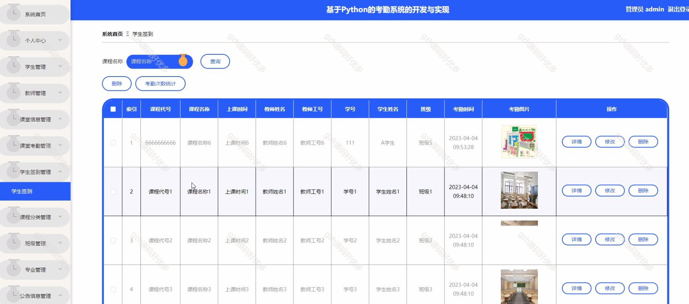

# python017
python017基于Django的考勤管理系统
 
## 查看主页获取源码

### 一、关键词

考勤管理，考勤管理系统

 

### 二、作品包含

源码+数据库+万字文档+PPT+全套环境和工具资源+部署教程

 

### 三、项目技术

前端技术：Html、Css、Js、Vue2.0、Element-ui
后端技术：Python3.7、Django2.0

  

 

### 四、运行环境（以下版本亲测，其他版本未知，请自测）

开发工具：PyCharm + VSCODE

数据库：MySQL5.7（最低要5.7版本）

数据库管理工具：Navicat10+

Python：Python3.7

前端Nodejs：14

浏览器：谷歌浏览器

 

### 五、项目介绍

项目编号：python017

考勤系统的目的是让使用者可以更方便的将人、设备和场景更立体的连接在一起。能让用户以更科幻的方式使用产品，体验高科技时代带给人们的方便，同时也能让用户体会到与以往常规产品不同的体验风格。

考勤系统分为学生、教师、管理员模块，学生可管理个人、课堂考勤、签到及公告、请假信息；教师能操作系统首页、个人中心，管理学生、课堂信息、考勤、签到、公告、请假及自身考核；管理员可全面管理系统首页、个人中心，以及学生、教师、课堂、课程等多类信息和考勤、考核事务，实现校园考勤全流程管控 。

 

### 六、运行截图

